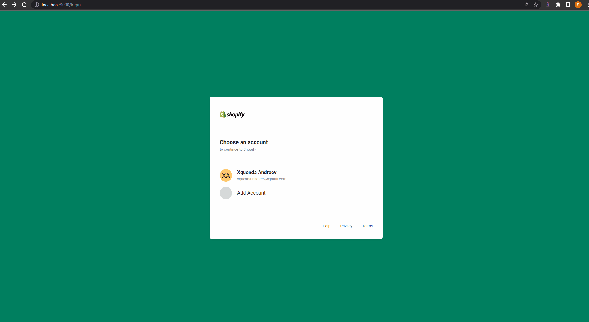
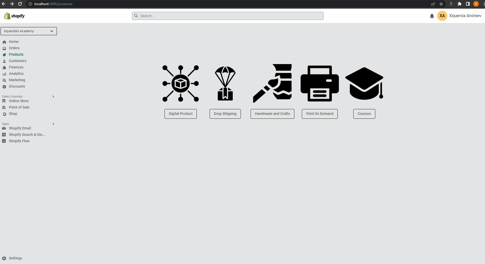
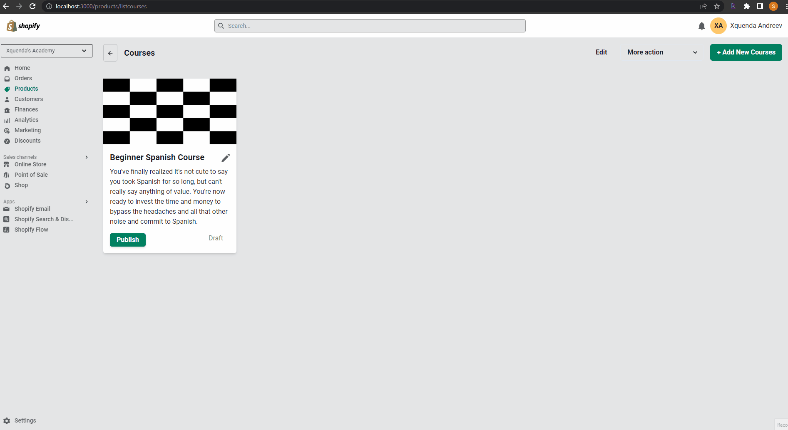
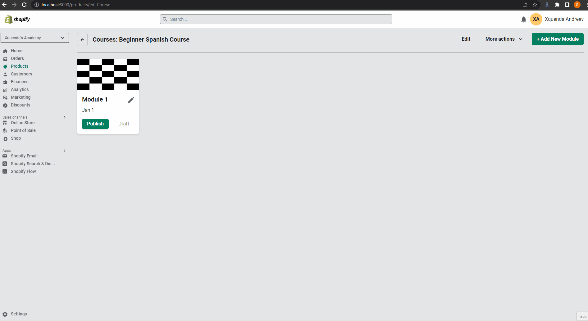
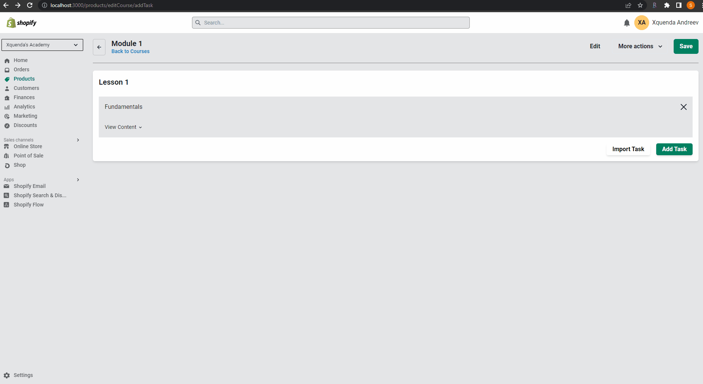

# shopify-industry-project

**Contents**
- [shopify-industry-project](#shopify-industry-project)
  - [📝 Description](#-description)
  - [⭐ Features](#-features)
  - [🧰 Tech Stack](#-tech-stack)
  - [👷 Contributors](#-contributors)
      - [Web Dev](#web-dev)
      - [UX Design](#ux-design)
      - [Data Science](#data-science)
  - [🖼️ GIFs](#️-gifs)
      - [Login screen](#login-screen)
      - [Create Course](#create-course)
      - [Create Module](#create-module)
      - [Create Lesson \& Task](#create-lesson--task)
      - [Save \& Publish Course](#save--publish-course)

## 📝 Description
This was an opt-in additional project for BrainStation post bootcamp where all three disciplines (Web Dev, UX & Data Science) collaborate together to create something for an industry partner.

We were given a few days to create a solution to the following problem space:

***How might Shopify better leverage its Ecosystem to make entrepreneurship more accessible than ever before?***

Our team decided to focus on the Online-Education industry space and created the app 'CourseBit'

The App shows a useable example of how an entrepreneur could use the platform to create an online language course. Example GIFs are shown below

## ⭐ Features

* Login with existing Shopify Account
* Create Online Education Course with Modules and Lessons
* Publish course online

## 🧰 Tech Stack

* React, Chakra UI, Polaris Iconography
* Node.js, Express

## 👷 Contributors

#### Web Dev

* [Simon Harlow](https://github.com/simon-harlow)
* [Irene Huynh](https://github.com/IreneHuynh)

#### UX Design

* [Demetria Leung](www.demetrialeung.com)
* [Usra Abid](https://usra-design.squarespace.com/)

#### Data Science

* [Fouad Farraj](https://www.linkedin.com/in/fouadfarraj/)

## 🖼️ GIFs

#### Login screen

#### Create Course

#### Create Module

#### Create Lesson & Task

#### Save & Publish Course
